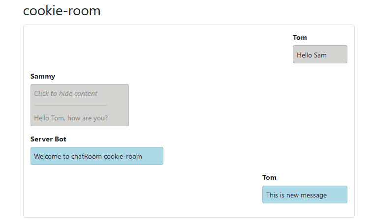
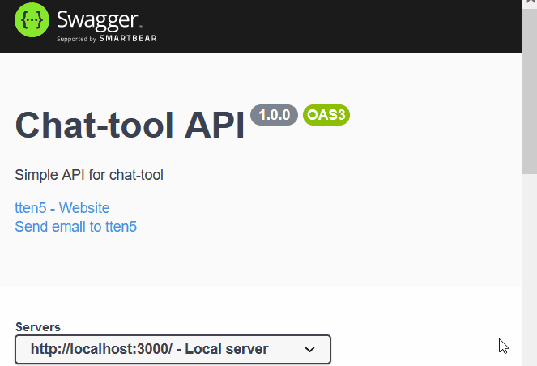

# chat-tool
chat-tool created with Nodejs, MongoDB, Vuejs and socket.io <br>
Auto documentation is created with `swagger`

- frontend: port `8080`
- backend: port `3000`

## How to start 
### Dev
- Go to each directory for frontend and backend separately 
- frontend: 
```
npm run serve
```
- backend:
```
node index 
```

### Production 
- Add this line in the backend

```js
    app.use(express.static(path.join(__dirname, '../vue-ui/dist')));
```

- frontend: 
```
npm run build
```
- backend:
```
node index 
```


## Hide/show on click 


## Swagger UI example 



